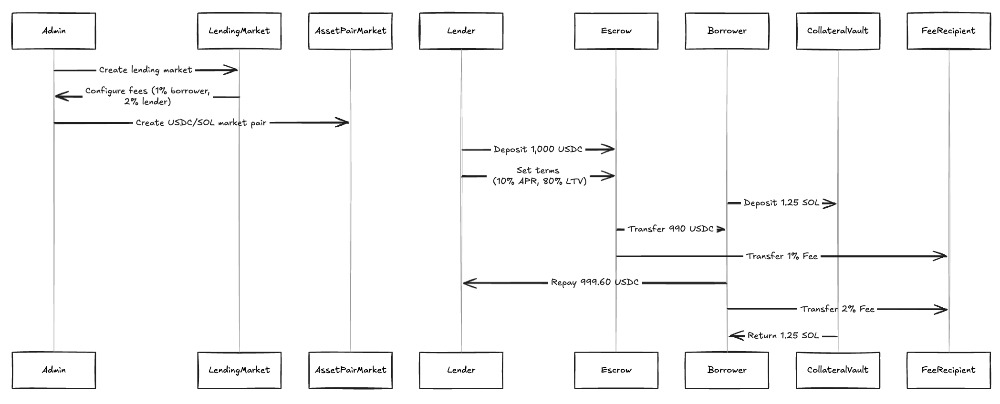

# Perpetual NFT lending

## Overview

Modular peer-to-peer lending protocol, where borrowers and Lenders choose their risk/reward (LTV/APR), is perpetual: no expirations, and no time-based liquidations, is an orderbook: users may determine yield/interest individually.

## User stories

#### Fees

- Protocol charges 1% fee of loan amount to borrower when taking a loan offer
- Protocol charges 2% fee of loan repay amount to market maker when
loan is repaid

#### For Lenders
- As a lender I am able to deposit capital to place a lending offer
- As a lender I am able to set the interest rate and LTV of my offer
- As a lender I can decide when to request for repayment wit 48hrs notice

#### For Borrowers
- As a borrower I can borrow capital against my NFT
- AS a borrower I repay the Loan and get back my NFT

### Sequence diagram

